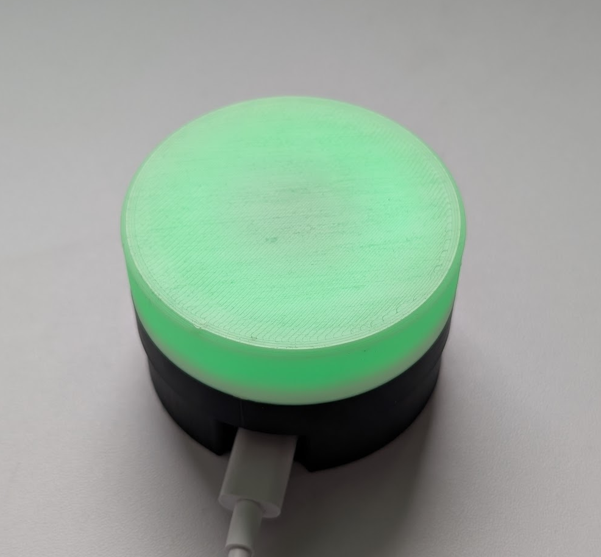

# Peak Power Indicator

This project is the physical companion to [Peak Power Forecast](https://github.com/Epyon01P/Peak-Power-Forecast), a Home Assistant integration that forecasts the expected quarter-hour peak demand. *Peak Power Forecast* performs the forecasting calculation, *Peak Power Indicator* takes that forecast and turns it into a visible, easy to understand LED signal:
- Green: headroom available, safe to turn on other devices
- Amber: warning zone, be careful to turn on other power-hungry devices
- Red: critical zone, don't turn on new devices or perhaps even turn off devices which are already on

 

*Peak Power Forecast* is a [ESPhome configuration](https://esphome.io/) you can flash to a ESP32 device. For the LED signal you can connect a WS2812b LED ring. It also has auto-brightness control by using a BH1750 ambient brightness sensor. Files to print a stylish enclosure you can 3D-print yourself can be found [here](https://www.printables.com/model/1677923-peak-power-indicator-light).

The core concept is simple:

- Home Assistant computes a predicted quarter-hour peak value.
- That prediction is translated to a color state.
- This device receives that color and renders it on a WS2812B LED ring.

The goal is to make peak-awareness passive, immediate, and household-friendly: you can see the situation at a glance from across the room, with no app interaction.

## Requirements

- Home Assistant with [Peak Power Forecast](https://github.com/Epyon01P/Peak-Power-Forecast) installed
- ESPHome device (tested on ESP32-S2 / Wemos S2 Mini)
- WS2812B LED (tested with a 12 LED ring)
- Ambient light sensor BH1750 (for auto brightness)

## Features

- Real-time LED color updates from `sensor.peak_power_forecast_color`
- Auto brightness based on ambient lux (BH1750)
- Manual brightness override
- Brightness curve tuned for low- and high light usability
- Home Assistant-exposed controls for brightness tuning
- Smoothing on lux input to reduce visual flicker

## Functionality

1. **Color display**  
   The device listens to `sensor.peak_power_forecast_color` and applies the received hex color directly to the LED ring.
2. **Automatic brightness control**  
   Ambient lux from BH1750 is used to dim in dark conditions (less disturbing) and increase brightness in bright conditions (better visibility).
3. **Perceptually tuned brightness curve**  
   Brightness uses a piecewise mapping (min -> mid -> max) instead of one single linear curve, which works better for human perception at low brightness.
4. **Manual override**  
   Auto brightness can be disabled and replaced by a fixed brightness setting.
5. **Home Assistant controls and telemetry**  
   Brightness parameters and live feedback are exposed as entities so behavior can be tuned without reflashing.

## Hardware

Tested configuration:

- **MCU:** Wemos S2 Mini (ESP32-S2)  
  Runs ESPHome and handles Wi-Fi plus runtime logic.  
  The configuration can also be flashed to other ESPHome-compatible boards with minor pin changes.

- **LED ring:** AZDelivery 50mm WS2812B (12 LEDs, 5V)  
  Displays the forecast color state and is driven through one data pin (`GPIO14` in the reference config).

- **Ambient light sensor:** BH1750 GY-302 (I2C)  
  Measures room lux and drives auto-brightness behavior.

- **Enclosure:** custom 3D-printed housing  
  I designed a [specific enclosure](https://www.printables.com/model/1677923-peak-power-indicator-light) for this project you can download from Printables.  
  The enclosure fits the Wemos S2 Mini, BH1750 module, and AZDelivery LED ring, includes a small ambient-light window to reduce LED self-interference on the sensor, and diffuses light to keep the device unobtrusive.

Notes:

- WS2812B runs on 5V
- BH1750 runs on 3.3V
- Keep wiring short and stable

## Installation

1. Install and configure [Peak Power Forecast](https://github.com/Epyon01P/Peak-Power-Forecast).
2. Verify `sensor.peak_power_forecast_color` updates correctly in Home Assistant.
3. Copy `peak-power-indicator.yaml` into your ESPHome setup.
4. Update device-specific settings:
   - device name / friendly name
   - Wi-Fi credentials
   - API / OTA as needed
5. Flash to the device (USB or OTA).
6. Place the indicator where it is easily visible.

## Wiring

| Component | Pin |
| --------- | --- |
| BH1750 SDA | GPIO8 |
| BH1750 SCL | GPIO9 |
| WS2812 Data | GPIO14 |

## Home Assistant Entities

### Controls

- **Auto brightness**: enable or disable adaptive mode
- **Manual LED brightness**: fixed brightness (0-100%)

### Advanced (config)

- **Auto brightness min LED brightness**: minimum brightness floor (night)
- **Auto brightness mid lux**: lux point where brightness targets ~50%
- **Auto brightness max lux**: lux point where brightness reaches 100%

### Sensors

- **Ambient light**: BH1750 measured lux
- **Current LED brightness**: applied brightness percentage

## Brightness Behavior

In auto mode, brightness uses a piecewise linear curve:

- 0 lux -> minimum configured LED brightness
- mid lux -> ~50% brightness
- max lux -> 100% brightness

This gives better practical behavior than a single linear mapping, especially in darker rooms.

Lux input is smoothed with a sliding window moving average (~60s in the default config) to reduce flicker from rapid ambient light changes.

## Design Philosophy

- Always-on passive feedback
- No user interaction required during normal use
- High household acceptance (visible but unobtrusive)
- Minimal device-side complexity
- Forecast intelligence stays in Home Assistant

## License
This work is licensed under a Creative Commons (4.0 International License): **Attribution**
